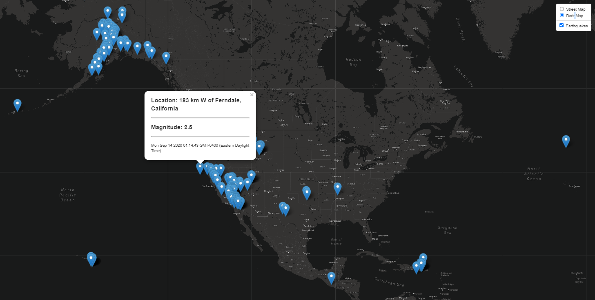

# leaflet-challenge
 ## USGS Earthquake Data displayed with Leaflet

 ## JavaScript, D3, Leaflet, HTML
 

This challenge uses D3 to read the earthquake JSON data at the USGA site to plot various earthquakes on an interactive map using leaflet.  

## Leaflet-Step-1

   * The data marker for each earthquake shows the following: Earthquakes with higher magnitudes are displayed with larger circles that are darker in color.

   * Click on an earthquake marker to diplay a popup with additional information about the earthquake:  Place, Magnitude, and Date.

## Leaflet-Step-2

   * Adds muliple map layers as options.  Earthquake data is added as an overlay layer.  Toggle earthquake data on and off.

   * Click on an earthquake marker to diplay a popup with additional information about the earthquake:  Place, Magnitude, and Date.

